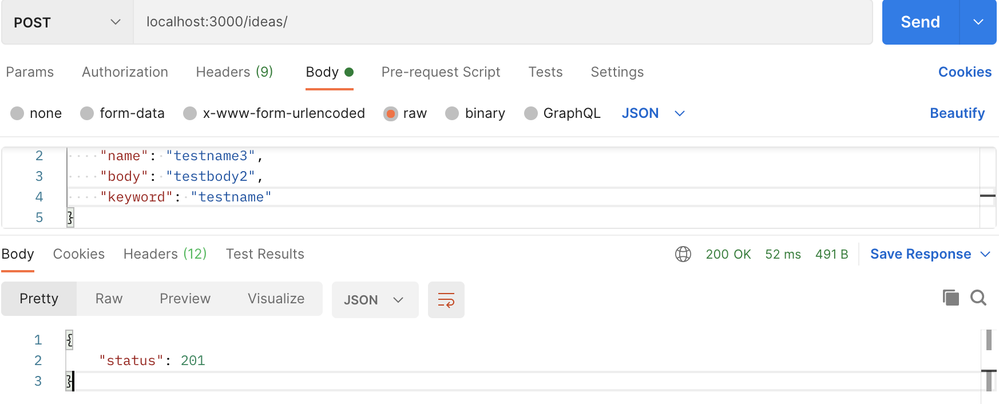
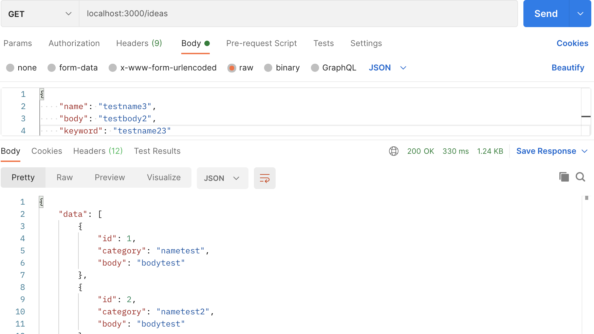
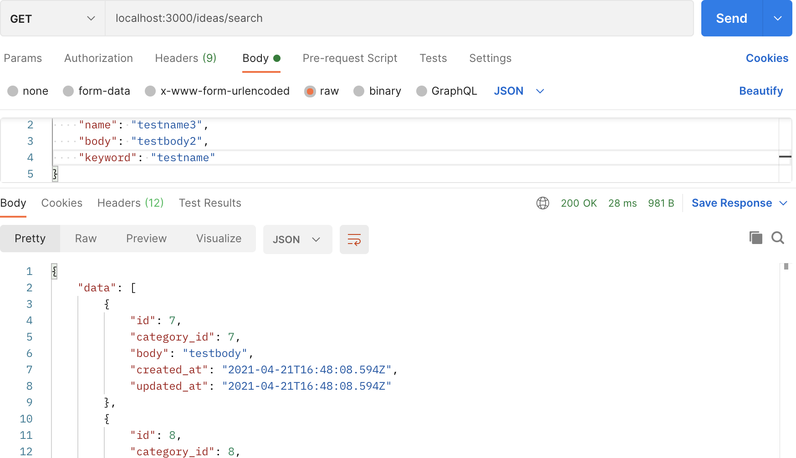
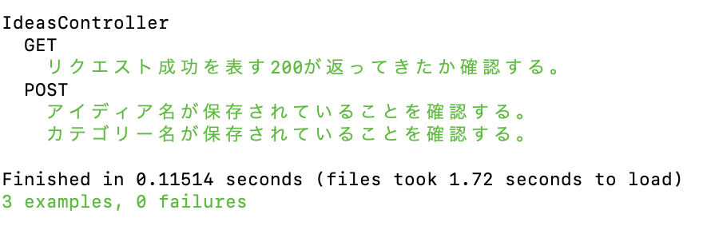
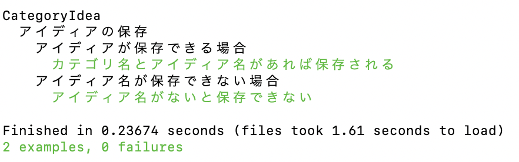

# IdeaAPI
#### 目次
　1.概要
　2.開発環境
　3.DB設計
　4.実装内容
　5.テスト内容
### 概要
本APIは、アイディアを管理するAPIである。
具体的な機能面は以下の通りである。
①カテゴリー別にアイディアを登録する。
　(カテゴリーの重複はさせない)
②登録したアイディアを取得する。
③指定したカテゴリーに紐づいたアイディアを取得する。

### 挙動結果(開発者向け)
①カテゴリー別にアイディアを登録する。

②登録したアイディアを取得する。

③指定したカテゴリーに紐づいたアイディアを取得する。

### テスト結果(開発者向け)
本APIにおいて、実施したテスト結果を以下に記載する。
- Controllerテスト

- Modelテスト

### 開発環境(開発者向け)
<dl>
  <dt>言語</dt>
  <dl>ruby(2.6.5p114)</dl>
  <dt>追加gem</dt>
  <dl>pry-rails rubocop
  rspec-rails(4.0.0) factory_bot_rails</dl>
  <dt>その他</dt>
  <dl>Postman(API挙動確認用アプリケーション)</dl>
</dl>

### DB設計(開発者向け)
#### categoriesテーブル
##### カテゴリー情報
| Column | Type   | Options                 |
| ------ | ------ | ----------------------- |
| name   | string | null:false unique: true |

#### categories_Association
- has_many :ideas

#### ideasテーブル
##### アイディア情報
| Column      | Type       | Options    |
| ----------- | ---------- | ---------- |
| category_id | references | null:false |
| body        | text       | null:false |
| category    | references |            |

#### ideas_Association
- belongs_to :category

以上
